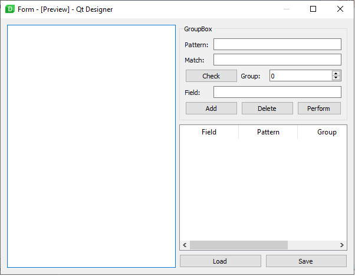

# pdfparser_gui
One page PDF forms parser with GUI (PyQt5).
This scatch tool with GUI can help with getting data from PDF-forms which consist of one page from many PDF multi-pages files.
Parsing with regular expression.

## Workflow

1. Open sample PDF-file with a example of one-page form.
2. Check pattern of regular expression in text field 'Pattern' on sample text by pressing push button 'Check'. If pattern was found it appears in text field 'Match'. Group of regular expression can be used with spinbox 'Group'.
3. Write a field name in text field 'Field' and press the push button 'Add' to add a field in table of fields.
4. Press the push button 'Perform' to choose a folder with PDF files of forms to perform parsing. The resul will be shown in tree view object, which will represent an hierarchy of files, pages and finding fields with values.
